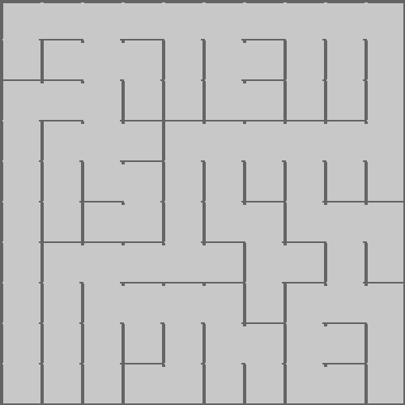
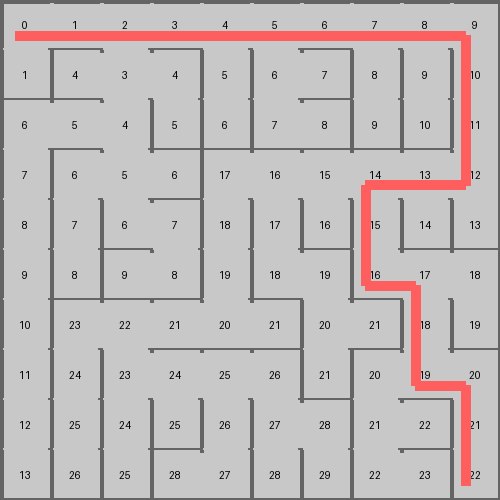

[](https://classroom.github.com/a/wtSBUmXu)
# Assignment 8: Maze Generating and Solving

Objectives

* Build graph data structures
* Implement common Graph algorithms
  * Djikstra's for path-finding
  
Stretch Goals

* Implement either a more complicated maze generator or solver
  * A potentially interesting generator: Eller's (described below) or Backtracker 
  * A potentially interesting solver: A* algorithm (described here: https://theory.stanford.edu/~amitp/GameProgramming/AStarComparison.html)
    * This would be an EXCELLENT thing to be able to discuss in interviews

## Overview

In this assignment, we're going to implement some algorithms to generate a maze, display it, and then 
to implement an algorithm to find a path through the maze. 

Here's an example of a maze we can generate: 



And an example of a solved maze: 




### Maze implementation

A maze is essentially a graph. We think about it as a grid of cells, where each cell (node) has a link (edge) to 
all of its neighbors. The edge is valued as either a "wall" or a "corridor" (passage). If a node doesn't have a 
neighbor to the north, east, south, or west, it's because it's at the edge of the grid. 

Grid implementations: 

* Matrix
* Adjacency list

In this project, we're using a kinda hybrid adjacency list/matrix representation. The `Grid` is a matrix of `Cells`; 
and `Cell`s are basically graph nodes, which keep track of their neighbors (like in an adjacency list). The difference is that
the adjacency list we saw in class was designed for an arbitrary number of edges/neighbors, while a `Cell` in this 
project has at most 4 neighbors: one to the North, South, East or West. Instead of keeping track of those neighbors in a 
*list*, we're keeping track of them in a Python dictionary in the `Cell`. 

We've got a few classes: 

* `Grid`: This is the grid for the maze, full of cells. 
* `Cell`: This is basically a node in the graph. 
* `BinaryTreeMazeMaker`: A simple algorithm that will make a maze for a provided grid. 
* `SidewinderMazeMaker`: A slightly more interesting algorithm to make a maze of a provided grid. 
* `DjikstraSolver`: A Djikstra implementation that finds a solution to a provided maze. 

### Grid

This is basically just a container class. It's 

* `Grid.prepare_grid()`: Create all the rows, populating them by creating cells
* `Grid.configure_cells()`: Iterate through all the cells, telling each cell what it's neighbors are (e.g. what `Cell.north`, etc are)
  * Hint: The north neighbor of `cell` is the one at row `cell.row - 1` and column `cell.col`
* `Grid.get_cell(row, col)`: Return the cell at the specified row, col. If the row, col is invalid (e.g. <0), return None. 
* `Grid.all_cells()`: Returns a flattened list of all the cells in the grid. (This is provided)
* `Grid.print()`: Prints out the grid. Here's a simple output of an empty grid: 

```
+---+---+---+---+
|   |   |   |   |
+---+---+---+---+
|   |   |   |   |
+---+---+---+---+
|   |   |   |   |
+---+---+---+---+
```

And a grid that has been made into a maze: 

```
+---+---+---+---+
|               |
+   +---+   +   +
|   |       |   |
+---+---+---+   +
|               |
+---+---+---+---+
```

To print, the algorithm should go something like this: 
* Print out the top line, that is the boundary
* Print out each row:
  * Print the pipe ('|') for the West boundary
  * Print the east walls of each cell:
      * If the cell is linked to it's east neighbor, it's a passage: don't print the pipe
      * If the cell is NOT linked to it's east neighbor, print the pipe. 
    * After the last cell in the row, print the newline ('\n')
  * Print the plus ('+'), for the West edge of the maze
  * Print the south walls of each cell:
      * If the cell is linked to it's south neighbor, it's a passage: don't print the "---"
      * If the cell is NOT linked to it's south neighbor, print the "---"
    * After the last cell in the row, print the newline ('\n')
  * Then, move on to the next row until you've printed all the rows. 
* You'll have to manually inspect the output to ensure it prints properly! 

* `Grid.export_image()`: 
  * This generates an image version of the maze. A simple image generating method is provided for you. 
    * This would make it easy to either create an image and print it out to solve, or even to build a web application that generates mazes and displays them to users. 
* Also: you'll see that the `Grid` class is set up with an iterator, so it can be easily used with `enumerate()`. The iterator will produce each cell in the grid one by one.


### Cell

A cell is basically a node in our graph. It keeps track of where it is in a grid (the row, col coordinates), 
which cells are to the north/south/east/west, and which neighbors are "linked" (e.g. there is a passageway) 
as opposed to being a wall between two cells. 

There are also some helper fields, `content` and `distance` which can be used to store some content 
to describe the cell and keep track of data to do some path finding. `distance` is basically the edge weight.
Feel free to add more attributes if you need. 

* `Cell.link(cell, bidirectional = True)`: Creates a passage between this cell and the provided cell. If `bidirectional == True`, create the same link (edge) between the other cell and this one. 
* `Cell.unlink(cell, bidirectional = True)`: Removes a passage (edge) between this cell and the provided one. If `bidirectional == True`, remove the edge from the other cell to this one. 
* `Cell.is_linked(cell)`: Returns `True` if this cell is linked to the provided cell (there's an edge from this cell to the other one)
* `Cell.neighbors()`: Returns a list of its neighbors: basically, the north, south, east, and west cells put into a list
* `Cell.get_closest_neighbor()`: Finds the linked neighbor that has the shortest distance assigned to it. If there are no linked neighbors, return None.
  * A ***Linked Neighbor*** is a neighboring `Cell` (e.g North/South/East/West) that has an edge/link/passage. 

### `BinaryTreeMazeMaker`

This is a simple maze maker algorithm that uses a "binary tree" approach to making a simple maze: 
It starts in the upper-left corner of the grid, and then "breaks" walls to either the east or the south, 
via a random choice. 

This maze making algorithm is simple, but the mazes aren't very interesting. It's provided as a reference 
to get you started with a basic maze and see how all the things come together. 

### `SidewinderMazeMaker`

The Sidewinder Maze algorithm is a little more interesting. Here's a summary of how it works: 

* Starting in the northwest corner
* "Flip a coin": Get a random number between 0 and 1 
  * If "tails" (e.g. the random number is 0)
    * Erase the east wall
    * Move to the eastern neighbor ("go through the corridor")
  * If "heads" (e.g. the random number is 1)
    * Choose one of the cells that we've just linked together, and delete the south wall. 
    * Move to the next eastern neighbor. 
* If you're at a cell that has no eastern neighbor, just delete the south wall. 
  * Go to the start of the next row, and repeat the process. 
* If you're in the last row, instead of choosing between removing the east or south wall, just remove the east wall.


### `DjikstraSolver`

The DjikstraSolver will take in a provided maze and find a path from the start (the upper-left corner of the maze) 
to the target (the lower-right corner of the maze) using Djikstra's algorithm. 

* `DjikstraSolver.solve()`: Uses Djikstra's algorithm to find a solution to the maze. 

Here's the general idea: 

* Initialize source: 
  * Set the distance attribute of all nodes (cells) in the graph (grid) to `float('inf')`
  * Set the distance for the source node (the north-west cell) to be 0
* Put all the nodes in the graph into a queue
* While there are more nodes in the queue: 
  * Get the node from the queue with the smallest distance assigned
  * Add it to the set of nodes that we know the distance to
  * For all the linked neighbors of the node, `relax` the weights 
* Recover the path from the grid: 
  * Start with the target cell (the cell at the south-east corner of the maze)
  * Put it in the path 
  * Until we get to the source: 
    * Find the linked neighbor that has the smallest distance
    * Put it in the path 
  * Reverse the path list
  * Return the path

### `EllerMazeMaker`

The general idea is as follows: Consider the grid one row at a time, sequentially. Assign unvisited cells 
in the current row to different sets. Randomly link adjacent cells that belong to different sets, marging the
sets together as you go. For each remaining set, choose at least one cell and carve south, adding the southern 
cell to the set as well. Repeat for every row in the rid. On the final row, link all adjacent cells that 
belong to different sets. 


## Your Task 

Build out the project around the structure that's provided. 

Here's a proposed approach: 

* Fill out the `Grid` and `Cell` classes. 
  * Once you've done this part, you should be able to create a basic maze with the provided `BinaryTreeMazeMaker`, and print it out. 
* Implement the `DjikstraSolver`. 
  * Once this appears to be working properly, expand. 
* Implement the `SidewinderMazeMaker`. 
  * Once you are making more interesting mazes with this algorithm, try your Djikstra solver on it
* Tweak the image generation to make the saved images more pleasing. 
  * The provided image generation is pretty rough; make some tweaks to make it more pleasing  
* Experiment and generate a few mazes. Save images of some more interesting ones and add them to your repo. 
  * Display them at the top of your README.md file so they can be easily viewed
* At this point, you have some options: 
  * Tweak and polish the image processing functions to produce nicer images
  * Implement the `EllerMazeMaker`
* Move this file to "instructions.md" and replace this README.md file with a summary of what you did and learned in this project, showing off your work as a portfolio project.
  * Include a couple of images of cool mazes your algorithm produced. 

## Installing Helper Libraries

You need 2 additional libraries to support the image part of this project. 

There are many ways to install libraries. If you know what you're doing, install the packages `pypng` and `Pillow`. 

If you are using PyCharm, here's one way to do this: 

* Go to the `Python Packages` tab in the bottom
* Search for "Pillow" and click the "Install" button
* Search for "pypng" and click the "Install" button
* If you have any issues or it seems to not be working, please reach out on Piazza. 
  * If this is an issue blocking you, you can comment out the imports in `a8.py` and remove the "export_image()" calls in the tests to get unblocked.  


I'm sharing this web page that describes the Maze generation algorithms and has some nice animations to 
help visualize how they work. The author does link to his code repo with implementations in JavaScript. 
They certainly aren't directly translateable to Python, but please don't read the code 
until you've at least begun to implement and do the assignment on your own. 

https://professor-l.github.io/mazes/


