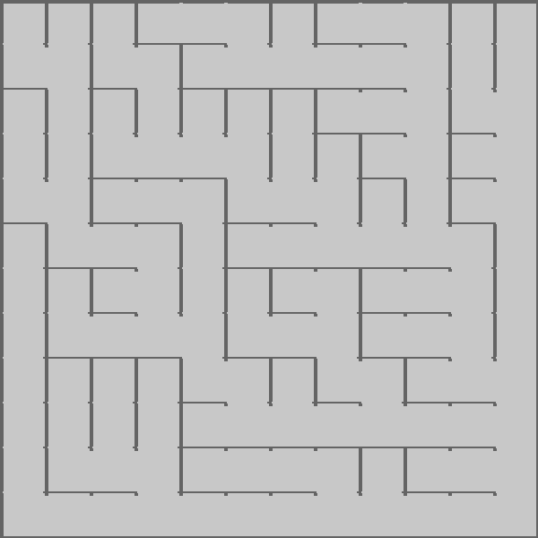
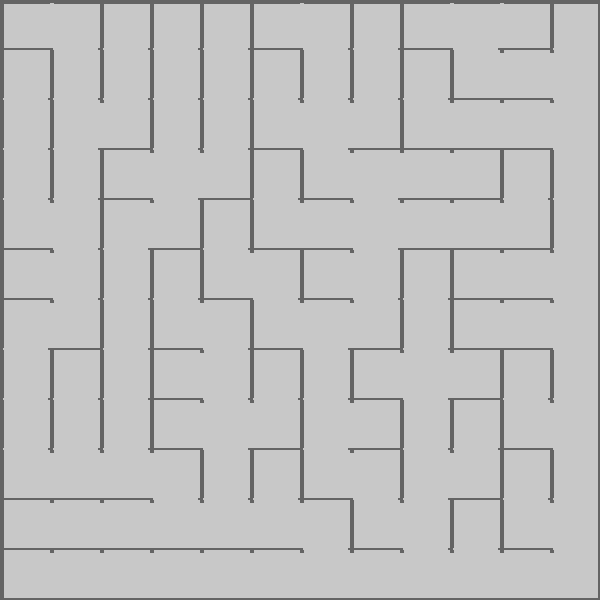
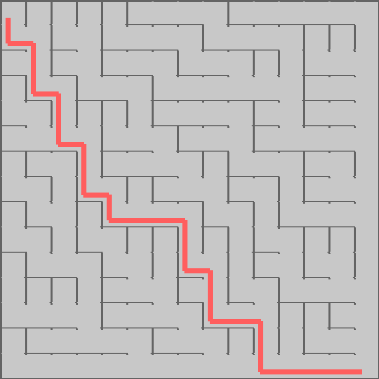
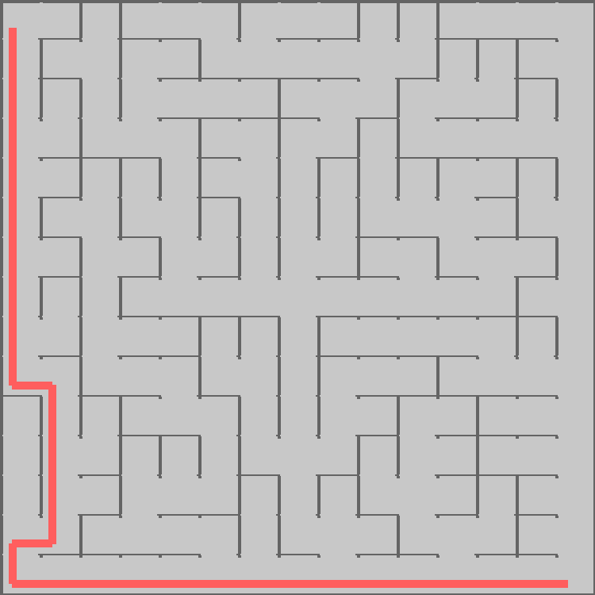

# Assignment 8: Maze Generating and Solving

UW, EE 590a
Fall 2023
Wilson Martinez

## Images
Here are some interesting images that I generated. Here you can see 2 random mazed genrated by the BinaryTreeMazeMaker, and the SidewinderMazeMaker, then 2 more random ones but solved using Djikstra's algorithm. The code I used to run this can be found in main()

1. 12x12 with Binary



2. 12x12 with Sideeinder



3. Solved 15x15 Binary - Djikstra



4. Solved 15x15 Sidewinder - Djikstra



## Code

### Grid
This implementation was relatively straigh forward. I had some issues with setting the neighbors, but once I worked thorugh Cell it was much easier.

Printing the grid was a challenge at first, the README was super hepful.

The key for grid id that fact that it is a 2d array of cells. This allows us to uodate the grid as we create maze and then print it out. The important thing is starting with a "full" grid and working your way from there. 

### Cell
Setting the neighbors here is different from linking. Setting the neighbors allows us to "map" the cells with respect to the neighbors, wheras linking saves the cells that are linked to the cell. This way we can keep track of what cells are linked and WHERE, so that we can traverse a maze with directionality. Note that links can be bidirectional. The closest cell function seems simple, but is going to be fundamental for Djikstra's, since it allows us to choose the "shortest" distance between a cell and it;s neighbors.

### SidewinderMazeMaker

This was the section of the code on which I got most stuck. I created 3 helped functions to simplify and break down my code. I created one to "flip a coin", another to remove the eastern wall, and another to remove the souther call. The reason I kept getting stuck was because I was skipping 2 crutial steps in the logic:

- If you're at a cell that has no eastern neighbor, just delete the south wall.
- If you're in the last row, instead of choosing between removing the east or south wall, just remove the east wall.

I had not realized why these 2 steps were so important. The first allows us to always ensire there is a path from one row to the next. We could potentailly encounter a sitauation where for a given row we never delete a southern wall, meaning that when we reach the end we've created a block, so by removing the wall here, we prevent that. The second ensures that at the bottom we have a "clear path". Following the same logic as above, we want to make sure we don't accidentally generate blockers.

Once I realized these 2 things, I was able to better follow the steps and hints provided to successfully implement this.

I had originally added some code to "catch" any exceptions. After I implemented the code well as I explained above, this section is useless, but I left it so that I could show my logic:

```python
# After creating the maze, check for any unlinked cells and link them
for row in self.grid.rows:
for cell in row:
    if not cell.links:
        # If the cell has no links, randomly link it to a neighbor
        neighbors = [neighbor for neighbor in cell.neighbor_cells.values() if neighbor]
        if neighbors:
            random_neighbor = self.random.choice(neighbors)
            cell.link(random_neighbor)
```

### DjikstrasSolver
I had actually seen this algorithm in a previous course that walked through the basics of graph theory. However, since it was integrated into this assignment, it was a new challenge and a new approach. 

Initializing the grid and finding the weight were pretty self explanatory, the tricky bits where in relaz and solve.

To implement relax, the important thing is first calculaitng a tentative new distance for a chosen cell, adding the existing distance and the weight and THEN conparing it to the existing distance. In this algorithm I could've chose to have < or <=, it would not change teh correctess of the logic but it could potentially change the outcome, since it would change the order of the traversal. I left it as <.

Recovering the path was not too hard. Since I just have to start at the end and wok back through the visited and chosen nodes. 

For the solution. I first initialize the space with infinate distances, except the neighbors of the starting point, whose distance I keep as they are. Until I am done, I had to loop through the list of potential "next visists", always finding the shortest distance. Once a shortest distance gets chosen, I "walk" to that cell. Then I add the neighbors (that I haven't already visited) to the list of potential next visits after "relaxing" them. This means evaluating if what's closest if the direct distance from the origin, or the new distance in the walked path. This ensures thta we're always considering or reevaluating the closest path. That's the key to this algorithm, this is what guarantees that if we encounter the goal node (the end of the maze), we can be certain that it is the shortest path available.
